# 🔥 FINAL PROJECT (FP) TEKNOLOGI KOMPUTASI AWAN 🔥

# Final Project 
### Teknologi Komputasi Awan

**Kelas A**

**Kelompok 1**
|Nama|NRP  |
|--|--|
|Bhisma Elki Pratama|5027221005|
|M. Januar Eko Wicaksono|5027221006|
|Jeany Aurellia Putri Dewati|5027221008|
|Siti Nur Ellyzah|5027221014|

## Permasalahan
Anda adalah seorang lulusan Teknologi Informasi, sebagai ahli IT, salah satu kemampuan yang harus dimiliki adalah Kemampuan merancang, membangun, mengelola aplikasi berbasis komputer menggunakan layanan awan untuk memenuhi kebutuhan organisasi.(menurut kurikulum IT ITS 2023 😙)

Pada suatu saat teman anda ingin mengajak anda memulai bisnis di bidang digital marketing, anda diberikan sebuah aplikasi berbasis API File: app.py dengan spesifikasi sebagai berikut.

Kemudian anda diminta untuk mendesain arsitektur cloud yang sesuai dengan kebutuhan aplikasi tersebut. Apabila dana maksimal yang diberikan adalah 1 juta rupiah per bulan (65 US$) konfigurasi cloud terbaik seperti apa yang bisa dibuat?

## Rancangan Arsitektur dan Tabel Harga Spesifikasi VM
- Berikut adalah rancangan arsitektur yang telah kami buat untuk final project kami
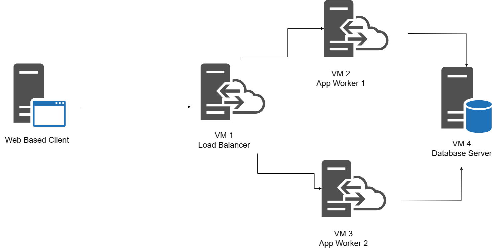
- Kami memilih untuk menggunakan Digital Ocean sebagai lingkungan cloud yang akan kami gunakan. Berikut adalah tabel harga spesifikasi VM yang kami buat  
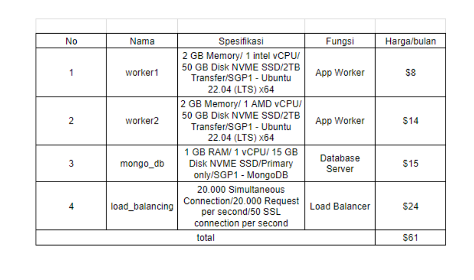

## Langkah Implementasi dan Konfigurasi Teknologi
1. Buat database dan copy connection string
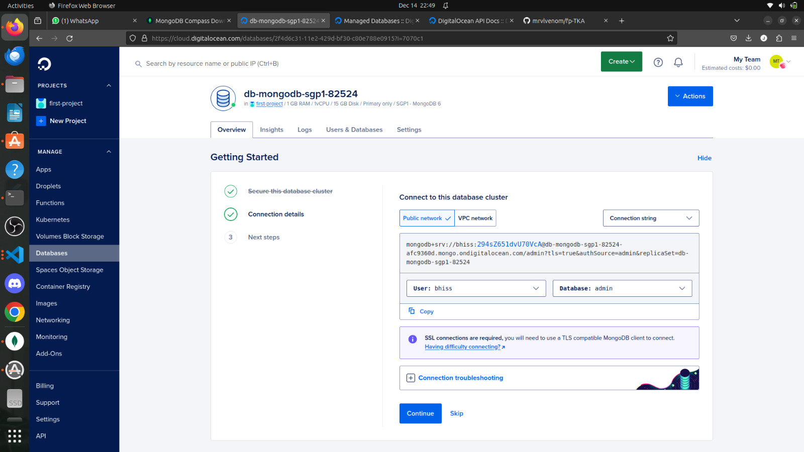

2. Create new connection dengan string database yang sudah di-copy sebelumnya
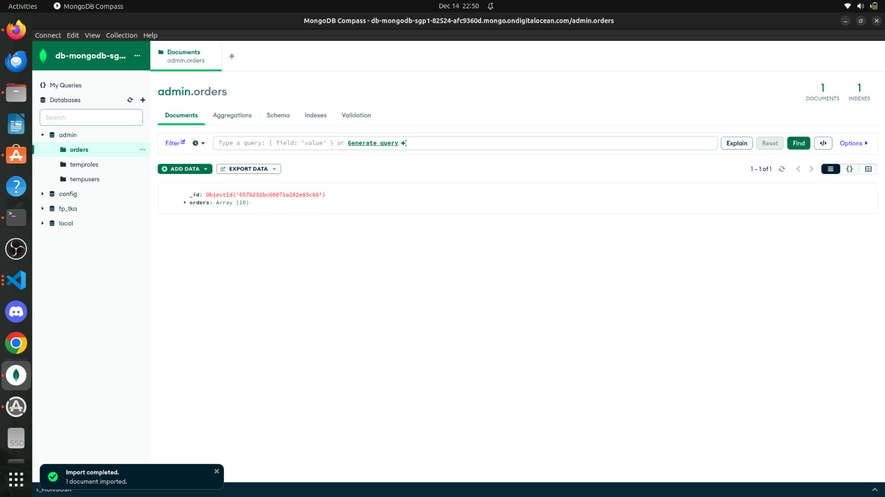

3. Buat database sesuai dengan variabel yang sudah dibuat di dalam app.py

4. Create database baru dengan collection order, add data (import json file)lalu pilih file orders.json yang berisi data-data yang akan dimasukan ke database 
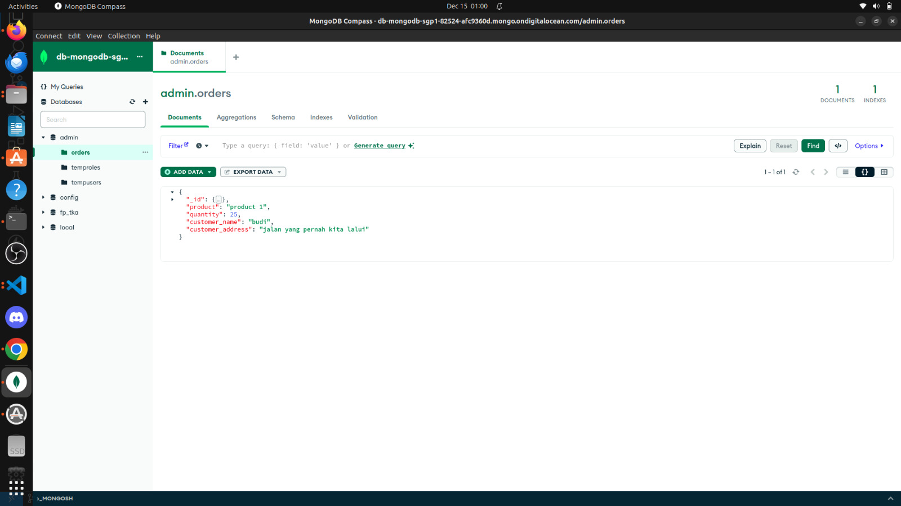

5. Run app.py hingga muncul url-nya
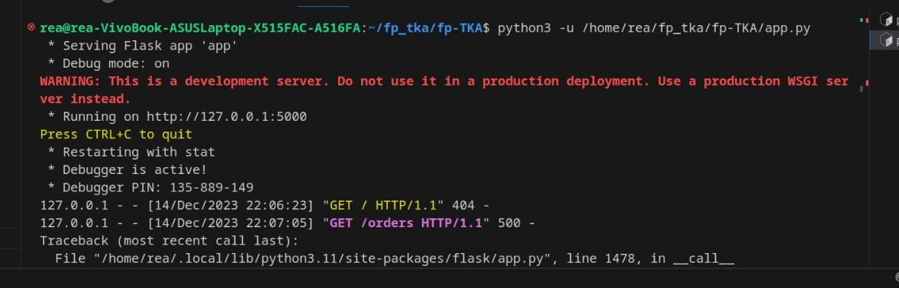

6. Untuk mengecek database-nya bisa menggunakan postman, request ke url/orders. Jika statusnya sudah 200 ok, maka database sudah bisa berjalan dengan normal
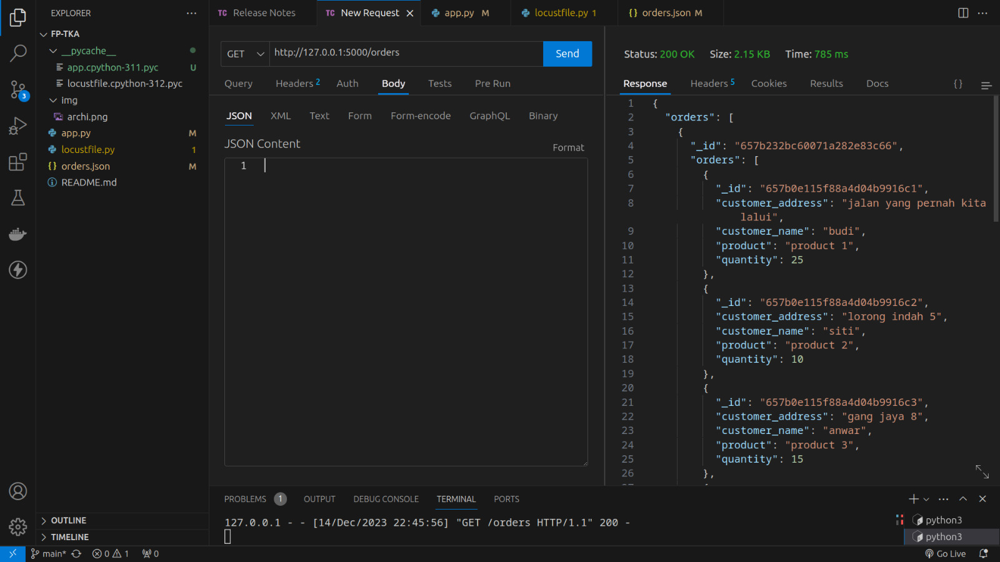

7. Deploy VM untuk worker dengan installasi requirement yang diperlukan di worker
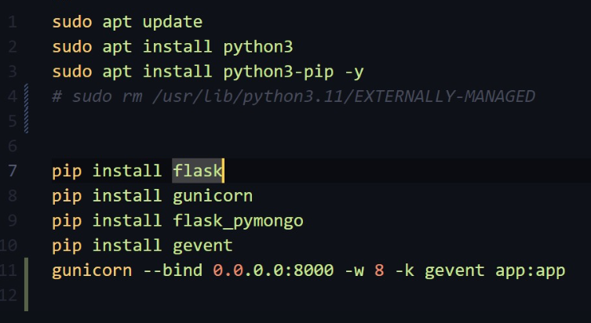

8. Install Nginx pada VM load Balancer, kemudian konfigurasikan dengan IP Address yang dimiliki oleh kedua worker, didalam konfigurasi nginx. Seperti dibawah ini:
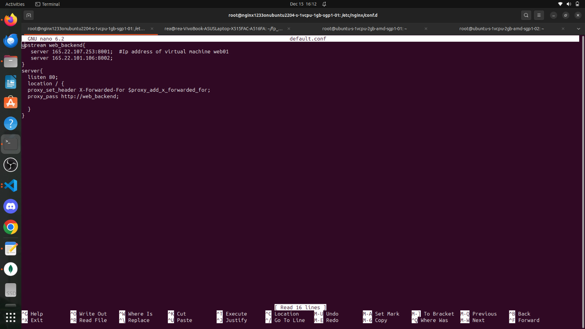

9. Kemudian jalankan nginx, dengan cara dibawah ini:
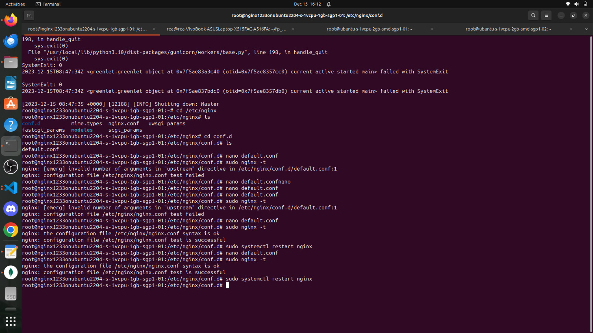

10. Setelah itu, IP Address dari loud balancer yang ada di digital ocean diuji coba, jika muncul database seperti dibawah ini maka sudah berhasil:
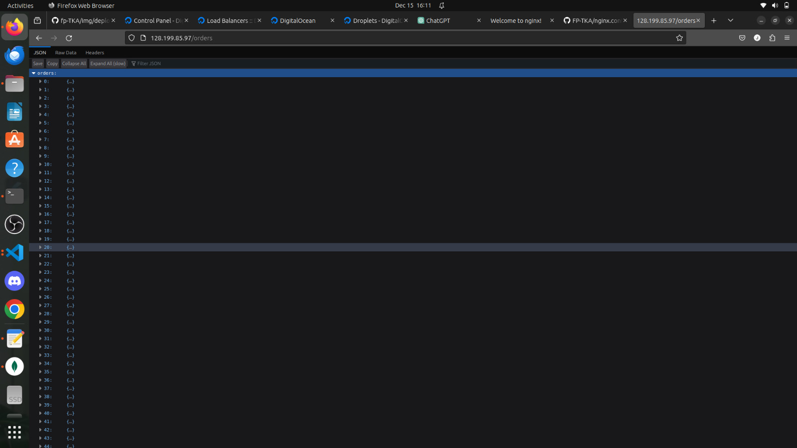

11. Jika tidak ada error, maka worker sudah berjalan

## Hasil Pengujian Setiap Endpoint
1. Get All Orders

2. Get a Specific Orders by ID
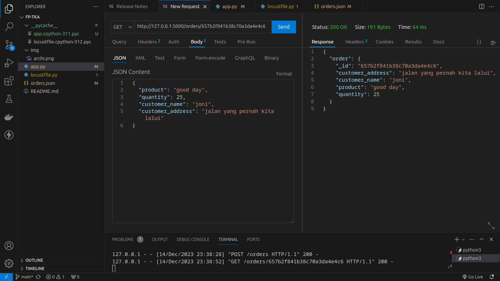

3. Create a New Order
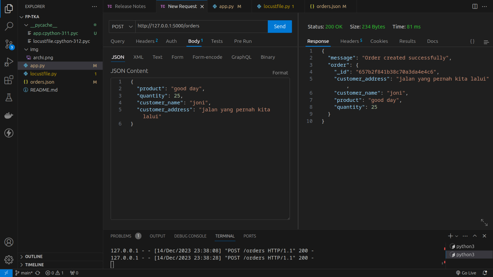

4. Update an Order by ID
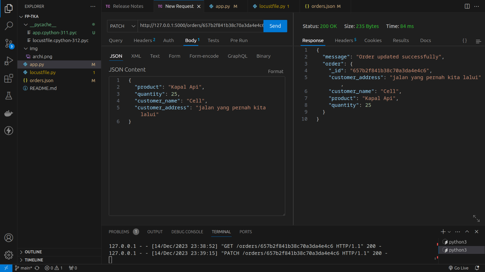

5. Delete an Order by ID
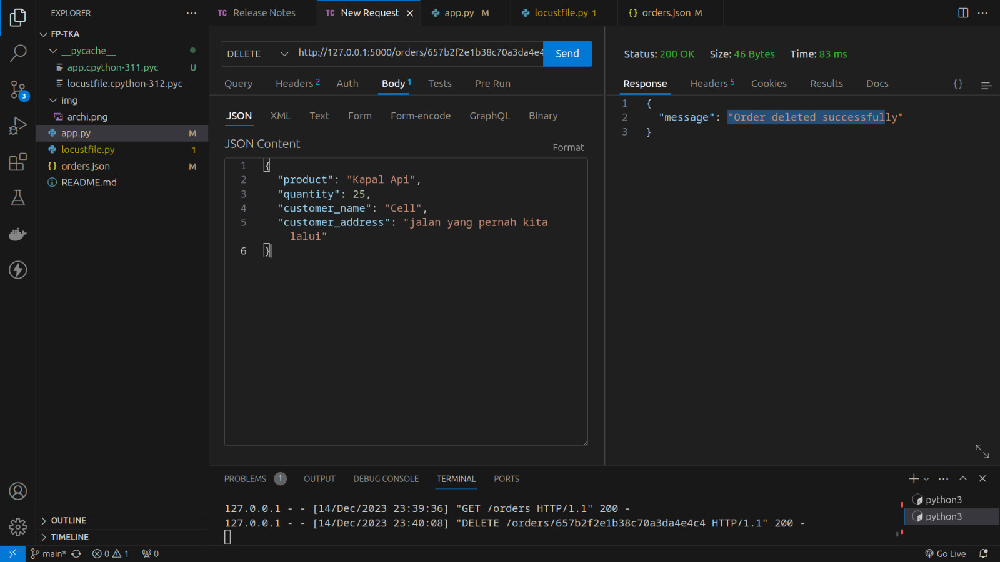

## Hasil Pengujian dan Analisis Loadtesting Locust
1. Endpoint Get Order pada Load Balancing yang menajalankan 1 worker nginx sebagai load balancing pada 1 device
- RPS Maksimum (load testing 60 detik)
- Peak Concurrency Maksimum (spawn rate 25, load testing 60 detik)

- Peak Concurrency Maksimum (spawn rate 50, load testing 60 detik)

- Peak Concurrency Maksimum (spawn rate 100, load testing 60 detik)
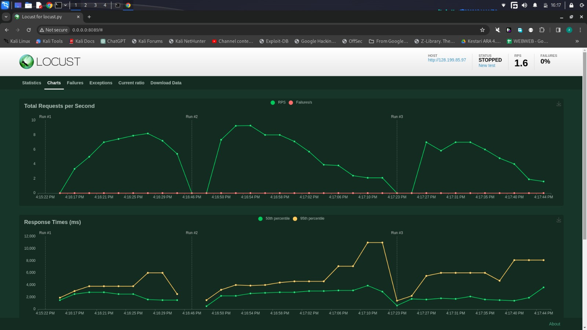
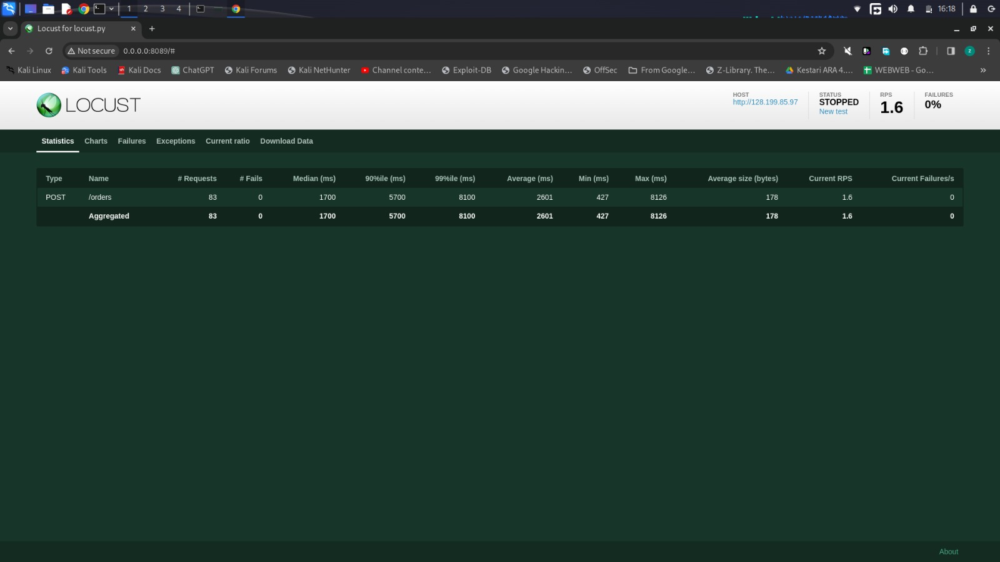

## Kesimpulan dan Saran
- Setelah melakukan pengecekan harga antara Azure dan Digital Ocean, ternyata harga untuk digital ocean lebih murah dibandingkan azure.
- Setelah melakukan percobaan, testing pada locust. Ketika spawn rate lebih rendah, persentase failures nya itu lebih kecil dibandingkan dengan spawn rate yang lebih tinggi  hingga 0% untuk persentasi failurse nya. Seperti pada grafik diatas.
- Setelah percobaan yang kami lakukan berulang kali, jumlah load balancer sebaiknya sama dengan jumlah worker karena ketika kami mencoba menggunakan 1 load balancer dan 3 worker terjadi down pada ketiga worker tersebut.
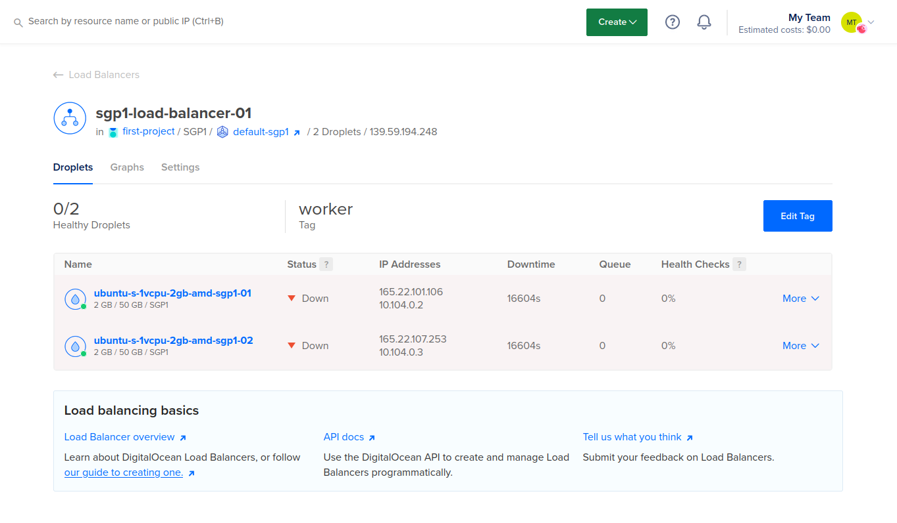
